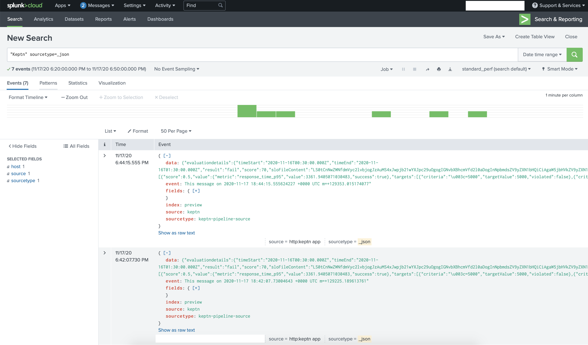
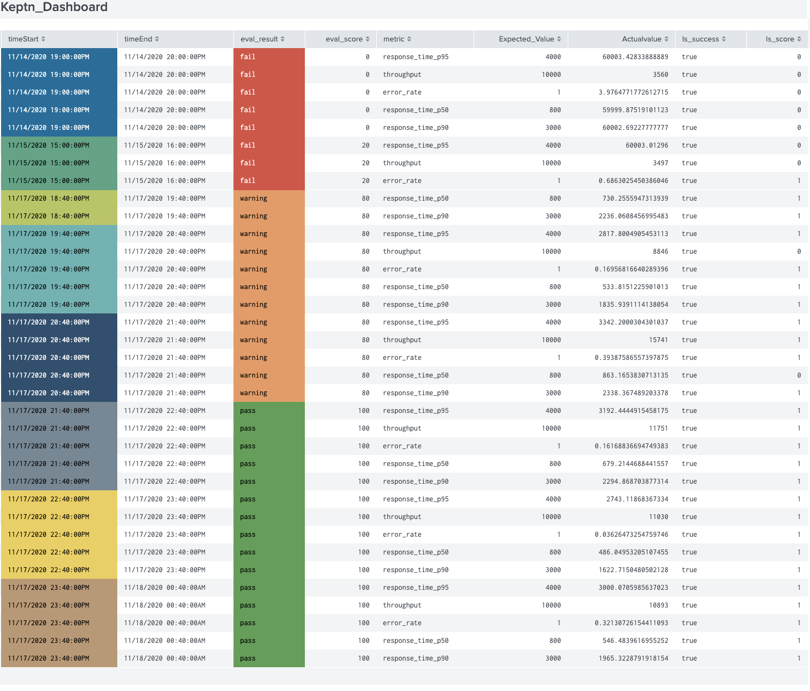

# README

This is a Keptn Splunk Service  written in GoLang. 


# splunk-service
The splunk-service is designed to forward keptn's event payload data to a Splunk HTTP event collector after evaluation done. It reads Spunk HEC arguments from JSON payload hec.config.yaml file and forward data to configured Splunk instance(s). At this point the container sends event data with the sourcetype "_json". Once JSON payload has been sent, open the Splunk Web Interface and search with `sourcetype` and/or `keyword`

### Build    

```
    # git clone https://github.com/keptn-sandbox/splunk-service.git

    # cd splunk-service

    # docker build -t splunk-service .   # Build docker image

    # docker push <repository>/splunk-service
```
    #### Note: Change image name in deploy/service.yaml 


### Deploy in your Kubernetes cluster

To deploy the current version of the *splunk-service* in your Keptn Kubernetes cluster, apply the [`deploy/service.yaml`](deploy/service.yaml) file:

```console
kubectl apply -f deploy/service.yaml
```

This should install the `splunk-service` together with a Keptn `distributor` into the `keptn` namespace, which you can verify using

```console
kubectl -n keptn get deployment splunk-service -o wide
kubectl -n keptn get pods -l run=splunk-service
```

### Uninstall

To delete a deployed *splunk-service*, use the file `deploy/*.yaml` files from this repository and delete the Kubernetes resources:

```console
kubectl delete -f deploy/service.yaml
```

### HEC Configuration
You need to configure Splunk host, token and endpoints into hec.config.yaml

```
payload:
    proto: https
    host: <splunkdev>.splunkcloud.com         #change <domain_name> to splunk cloud organization name 
    port: 443
    token: 00000000-0000-0000-0000-000000000000     # Splunk token
    index: preview
    sourcetype: keptn-pipeline-source
    source : keptn
    endpoints:
        health: /services/collector/health
        raw: /services/collector/raw
```
### Data on Splunk

You can search for data in splunk instance



Data on Splunk Web Interface dashboard. 



This service tested on minikube and AWS EKS clusters. 
## License

Please find more information in the [LICENSE](LICENSE) file.
